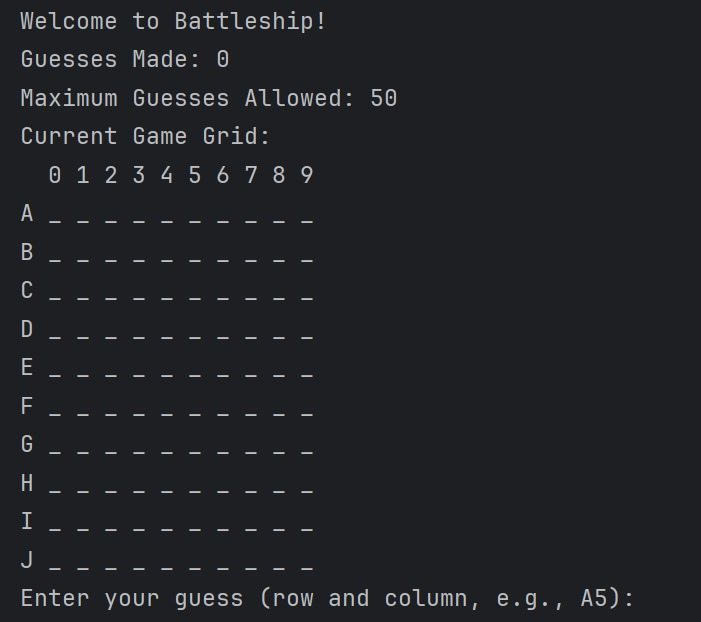
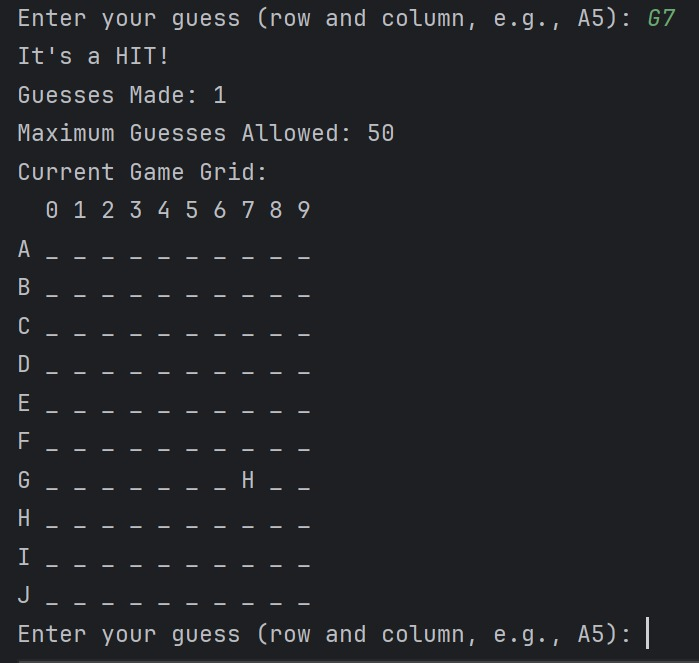
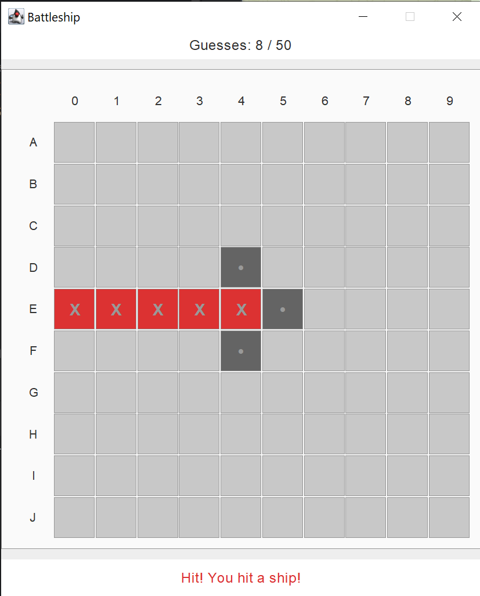

# Battleship Game

A Java application demonstrating the Model-View-Controller (MVC) design pattern with multiple UI implementations and comprehensive testing

## 📋 Overview

This project implements a classic Battleship game where players guess ship locations on a 10x10 grid. The application showcases:

- Clean **MVC architecture** with proper separation of concerns
- **Multiple UI implementations** - Console and Swing GUI
- **Interface-based design** for flexibility and testability
- **Input validation and error handling**
- Comprehensive **unit testing** (model)
- Both manual and Mockito **mock testing** (controller) to practice different mocking approaches
- **Dependency Injection Pattern** and **loose coupling**
- Best Practices: **SOLID principles**, **clean code**, and **professional testing strategies**

This implementation showcases the power of MVC architecture:  

- **Same Model, Multiple Views**: One game logic supports both console and GUI interfaces
- **Loose Coupling**: Views and controllers can be swapped without affecting the model
- **Testability**: Model logic tested independently of UI concerns
- **Extensibility**: Easy to add new UI frameworks (web, mobile) using the same model
- **Maintainability**: Changes to UI don't affect game logic and vice versa

<div align="center">
  <table>
    <tr>
      <th colspan="2" style="text-align: center; padding: 10px; font-size: 18px;">Console Interface</th>
    </tr>
    <tr>
      <td style="text-align: center; padding: 10px;">
        
        <br><b>Game Start</b>
      </td>
      <td style="text-align: center; padding: 10px;">
        
        <br><b>Gameplay</b>
      </td>
    </tr>
    <tr>
      <th colspan="2" style="text-align: center; padding: 10px; font-size: 18px;">Swing GUI Interface</th>
    </tr>
    <tr>
      <td style="text-align: center; padding: 10px;">
        
        <br><b>Game Start</b>
      </td>
      <td style="text-align: center; padding: 10px;">
        
        <br><b>Gameplay</b>
      </td>
    </tr>
  </table>
</div>

## 🎮 How to Play

**Console Version**

- Start the game: Run ConsoleApp.java
- Enter coordinates: Type row letter (A-J) + column number (0-9), e.g., "A5"
- View results: See HIT or MISS feedback and updated grid
- Continue guessing: Find all ships before running out of 50 guesses
- Game ends: Win by sinking all ships or lose after 50 guesses

**Swing GUI Version**

- Start the game: Run SwingApp.java
- Click coordinates: Click on grid cells to make guesses
- Visual feedback: See immediate color-coded HIT/MISS results

## 🚀 Features

- Ship Placement: Random placement of 5 ships (Aircraft Carrier, Battleship, Submarine, Destroyer, Patrol Boat)
- Multiple Interfaces:
  - Console-based interface with text input
  - Swing GUI with clickable grid interface
- Input Validation:
  - Coordinate format checking (letter + number)
  - Range validation (A-J for rows, 0-9 for columns)
  - Duplicate guess prevention
  - Case-insensitive input (accepts a5, A5)
- Game State Management:
  - Win condition: Sink all ships
  - Loss condition: Use all 50 guesses
  - Real-time guess tracking and grid display
- User Experience: Clear hit/miss feedback, error messages, and final ship revelation

## 🏗️ Architecture
The application follows the MVC pattern with clear separation of concerns:

```bash
src/main/java/battleship/
├── model/
│   ├── IBattleshipModel.java                          # Model interface
│   ├── BattleshipModel.java                           # Game logic implementation
│   ├── ShipType.java                                  # Ship type enumeration
│   └── CellState.java                                 # Cell state enumeration
├── view/
│   ├── IBattleshipView.java                           # View interface
│   ├── BattleshipConsoleView.java                     # Console UI implementation
│   └── SwingBattleshipView.java                       # Swing GUI implementation
├── controller/
│   ├── IBattleshipController.java                     # Controller interface
│   ├── BattleshipConsoleController.java               # Console controller implementation
│   └── SwingBattleshipController.java                 # Swing controller implementation
├── ConsoleApp.java                                    # Console application entry point
└── SwingApp.java                                      # Swing application entry point

src/test/java/battleship/
├── model/
│   ├── BattleshipModelPlacementTest.java              # Ship placement tests
│   ├── BattleshipModelPlayerInteractionTest.java      # Player interaction tests
│   ├── BattleshipModelGameStateTest.java              # Game state tests
│   └── BattleshipModelIntegrationTest.java            # Integration tests
└── controller/
    ├── BattleshipConsoleControllerTest.java           # Manual mock tests
    ├── BattleshipConsoleControllerMockitoTest.java    # Mockito framework tests
    └── BattleshipConsoleControllerparseGuessTest.java # Input parsing tests
```

## 🛠️ Technologies

Java 17+ - Core language  
Swing - GUI framework
JUnit 5 - Testing framework  
Mockito 5.9.0 - Mocking framework for controller tests  
  
Libraries required for mock testing:  
[byte-buddy](https://repo1.maven.org/maven2/net/bytebuddy/byte-buddy/)  
[byte-buddy-agent](https://repo1.maven.org/maven2/net/bytebuddy/byte-buddy-agent/)  
[mockito-core](https://repo1.maven.org/maven2/org/mockito/mockito-core/)  
[mockito-junit-jupiter](https://repo1.maven.org/maven2/org/mockito/mockito-junit-jupiter/)  
[objenesis](https://repo1.maven.org/maven2/org/objenesis/objenesis/)  
